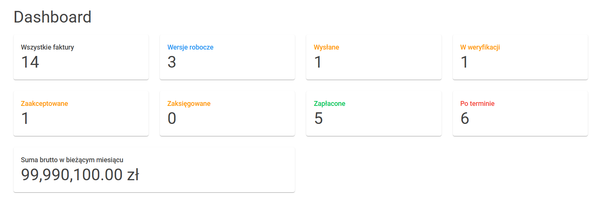
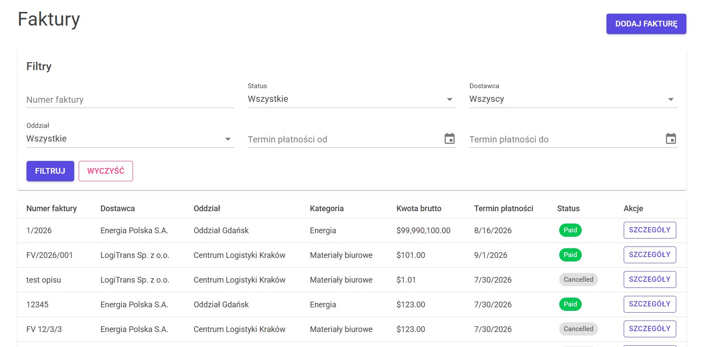
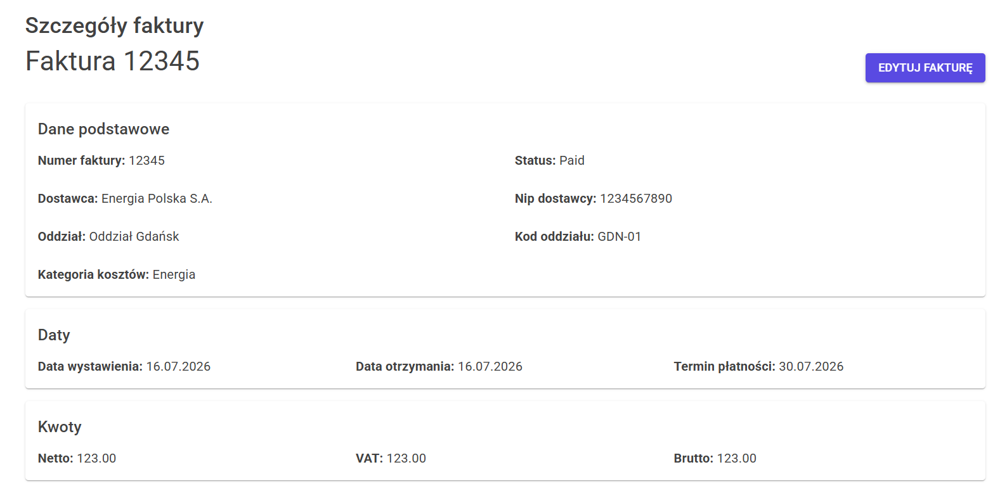
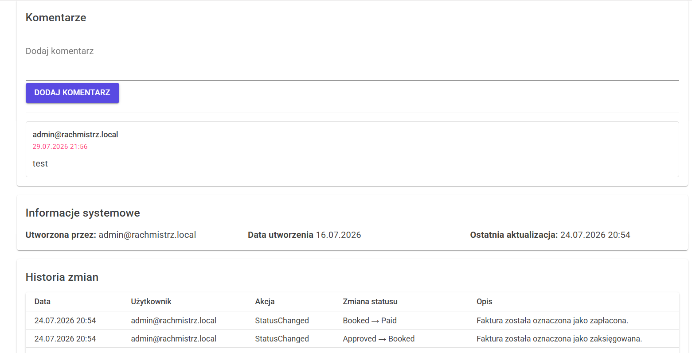
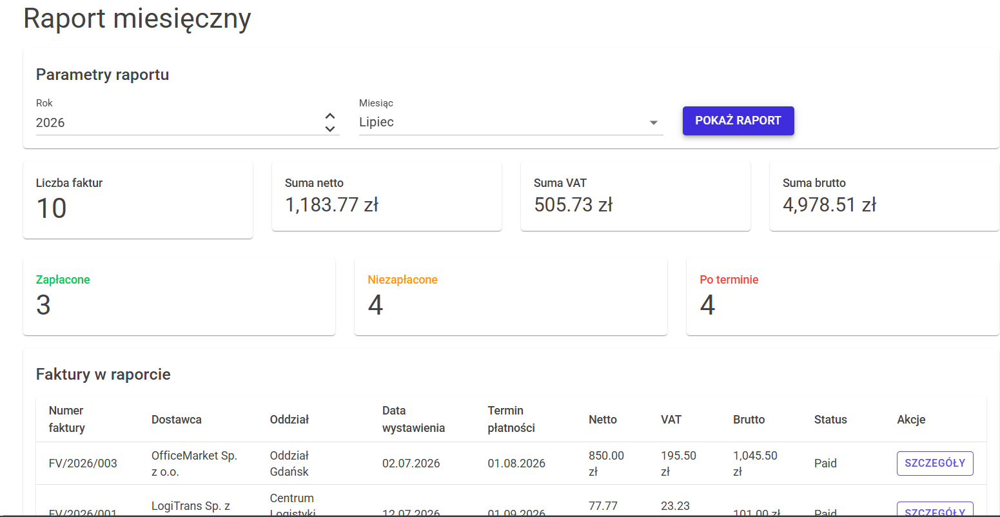

# Rachmistrz

Rachmistrz is a Blazor web application for managing cost invoices in a postal/logistics organization.

The application allows users to create invoices, assign them to branches, suppliers and cost categories, manage invoice status workflow, add comments, review audit history and analyze invoices through dashboard and monthly reports.

## Features

- User authentication with ASP.NET Core Identity
- Role-based invoice access
- Invoice list with filtering and pagination
- Invoice creation
- Invoice details page
- Invoice editing
- Invoice status workflow
- Invoice audit log
- Invoice comments
- Suppliers list
- Branches list
- Cost categories list
- Dashboard with invoice statistics
- Monthly invoice report

## Screenshots

### Dashboard


### Invoice list


### Invoice details



### Monthly report


## Roles

The application uses four main roles:

### Admin

- Can view all invoices
- Can manage invoice data
- Can access all invoice actions

### Accounting

- Can view all invoices
- Can create and edit invoices
- Can process invoice workflow actions

### BranchManager

- Can view invoices assigned to their branch
- Can approve or reject invoices from their branch
- Can comment on accessible invoices

### Employee

- Can view invoices created by themselves
- Can create invoices
- Can comment on accessible invoices

## Invoice workflow

The invoice status workflow is:

```text
Draft -> Submitted
Submitted -> UnderReview
UnderReview -> Approved
UnderReview -> Rejected
Approved -> Booked
Booked -> Paid
```

Invoices can also be cancelled when the user has the required permissions.

## Technologies

- C#
- ASP.NET Core
- Blazor
- Entity Framework Core
- ASP.NET Core Identity
- SQL Server
- MudBlazor
- Git / GitHub

## Test accounts

| Role | Email | Password |
|---|---|---|
| Admin | admin@rachmistrz.local | Admin123! |
| Accounting | accounting@rachmistrz.local | Test123! |
| BranchManager | manager.krakow@rachmistrz.local | Test123! |
| Employee | employee.krakow@rachmistrz.local | Test123! |

## Local setup

1. Clone the repository.

```bash
git clone <https://github.com/Wulfgarr/Rachmistrz.git>
```

2. Open the solution in Visual Studio.

3. Configure the database connection string in `appsettings.json`.

```json
"ConnectionStrings": {
  "DefaultConnection": "Server=(localdb)\\mssqllocaldb;Database=RachmistrzDb;Trusted_Connection=True;MultipleActiveResultSets=true"
}
```

4. Apply database migrations.

```bash
Update-Database
```

5. Run the application.

6. Log in using one of the test accounts.

## Project purpose

This project was created as a portfolio application to practice building a real-world business web application with Blazor, Entity Framework Core, ASP.NET Core Identity, role-based permissions and a structured Git workflow.

## Future improvements

- Export monthly report to Excel
- PDF invoice attachments
- OCR invoice scanning
- Integration with KSeF
- Email notifications
- Advanced reporting
- More detailed permission policies
- Unit and integration tests
- Production deployment